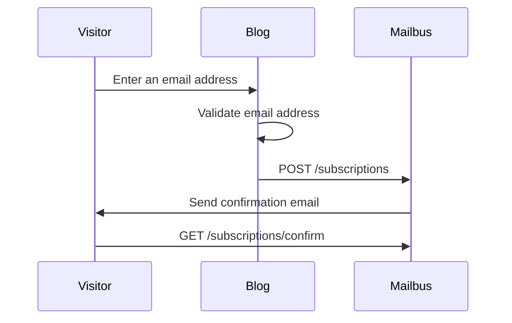

# Mailbus

Mailbus is a self-hosted email newsletter that allows:
- A blog visitor to subscribe to the newsletter
- Blog author to send an email to all subscribers
- A subscriber to unsubscribe from the newsletter

## API Design

- POST /subscriptions: sign up a new subscriber
- GET /subscriptions/confirm: subscriber consent
- GET /unsubscribe: unsubscribe from the newsletter

## Data Schema

```sql
CREATE TABLE subscriptions (
    id            INTEGER PRIMARY KEY AUTOINCREMENT,
    email         TEXT NOT NULL UNIQUE,
    subscribed_at TIMESTAMP DEFAULT CURRENT_TIMESTAMP
);

CREATE TABLE subscription_tokens (
    subscription_token TEXT NOT NULL,
    subscriber_id      INTEGER NOT NULL REFERENCES subscriptions (id),

    PRIMARY KEY (subscription_token)
);
```

## Sequence Diagram


